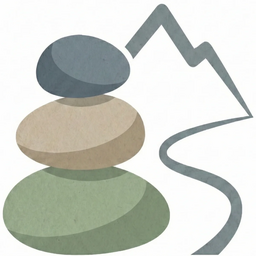

<p align="center">
  
</p>


# Cairn-PKM

A markdown-based personal knowledge management system for Obsidian with LLM integration.

---

## What is Cairn-PKM?

Cairn-PKM is an opinionated folder structure for organizing personal and professional knowledge in plain markdown files. Like the stone trail markers (cairns) that guide hikers through unfamiliar terrain, Cairn provides just enough structure to keep you oriented without getting in your way.

## Features

- **Plain text** — Markdown files with YAML frontmatter. No lock-in.
- **Co-location** — Everything for a project lives in its folder.
- **Two track types** — Areas (ongoing) and Projects (temporary).
- **Portable core** — Update `_cairn-pkm/` by replacing the folder.
- **Local customization** — Vault-specific content stays in `_local/`.
- **LLM commands** — 12 commands for conversational interaction with your vault.

## Structure

```
vault/
├── _cairn-pkm/     # Portable system (replace to update)
├── _local/         # Your customizations
├── Capture/        # Inbox
├── Objects/        # Cross-cutting entities (contacts, devices, accounts)
└── Tracks/         # Areas and projects
    ├── area-*/     # Ongoing domains
    └── p###-*/     # Temporary projects
```

## Quick Start

1. Download the [latest release](https://github.com/SFZC-WebOps/cairn-pkm/releases)
2. Unzip and open in Obsidian
3. Install required plugins: **Dataview**, **Templater**
4. Run `!tour` for a guided walkthrough

See [_INSTALLATION.md](_cairn-pkm/llm/uploads/_INSTALLATION.md) for detailed setup.

## LLM Commands

Cairn-PKM includes commands for working with your vault through LLMs like Claude.

| Command | Purpose |
|---------|---------|
| `!hi` | Open session menu or view a track |
| `!bye` | Close session with logging |
| `!help` | Command reference |
| `!tour` | Guided walkthrough |
| `!create area` | Create new area |
| `!create project` | Create new project |
| `!create task` | Create new task |
| `!create object` | Create new object |
| `!edit` | Edit any entity |
| `!capture` | Quick capture from conversation |
| `!changelog` | Document system changes |
| `!skills` | Track skill evidence |

## Documentation

- **[_ARCHITECTURE.md](_cairn-pkm/llm/uploads/_ARCHITECTURE.md)** — Complete system documentation
- **[_INSTALLATION.md](_cairn-pkm/llm/uploads/_INSTALLATION.md)** — Setup and migration guide
- **[cmd-*.md](_cairn-pkm/llm/uploads/)** — Individual command specifications

## Requirements

- [Obsidian](https://obsidian.md)
- [Dataview](https://github.com/blacksmithgu/obsidian-dataview) plugin (required)
- [Templater](https://github.com/SilentVoid13/Templater) plugin (required)
- [Tasks](https://github.com/obsidian-tasks-group/obsidian-tasks) plugin (recommended)

## Status

⚠️ **Beta release** — Commands and workflows may evolve. Feedback welcome via [GitHub Issues](https://github.com/SFZC-WebOps/cairn-pkm/issues).

## Brand Kit

Visual identity assets available as a separate download: [cairn-pkm-brand-kit.zip](https://github.com/SFZC-WebOps/cairn-pkm/releases)

## License

MIT License. See [LICENSE](LICENSE).
